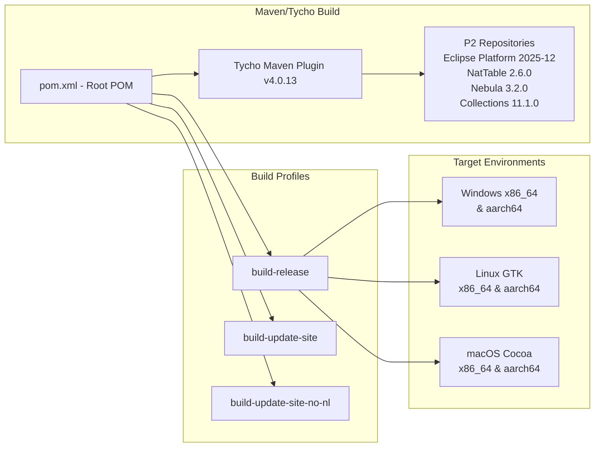
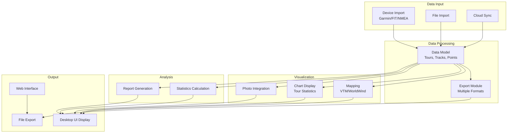
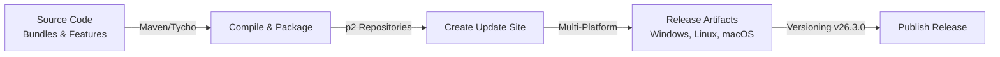

# MyTourbook Project Architecture Flowchart

## Project Overview
MyTourbook is a Java-based desktop application for managing tours and GPS tracks built on Eclipse RCP platform using Maven/Tycho build system.

## High-Level Architecture

```mermaid
graph TB
    subgraph "User Interface"
        UI[MyTourbook Desktop App]
    end
    
    subgraph "Core Bundles"
        Main[net.tourbook - Main Bundle]
        Chart[net.tourbook.chart]
        Common[net.tourbook.common]
        Model[net.tourbook.model]
        Device[net.tourbook.device]
        Photo[net.tourbook.photo]
        Export[net.tourbook.export]
        Stats[net.tourbook.statistics]
        Print[net.tourbook.printing]
        Cloud[net.tourbook.cloud]
        Web[net.tourbook.web]
    end
    
    subgraph "Device Support"
        Garmin[net.tourbook.device.garmin]
        GarminFIT[net.tourbook.device.garmin.fit]
        NMEA[net.tourbook.device.nmea]
    end
    
    subgraph "External Libraries"
        VTM[net.tourbook.ext.vtm - Vector Tiles Map]
        WorldWind[net.tourbook.ext.worldwind - 3D Mapping]
        Velocity[net.tourbook.ext.velocity]
        RXTX[net.tourbook.ext.rxtx - Serial Communication]
        Apache[net.tourbook.ext.apache]
        EJB[net.tourbook.ext.ejb3]
        GeoClipse[net.tourbook.ext.geoclipse]
    end
    
    subgraph "Testing"
        UnitTests[net.tourbook.tests]
        UITests[net.tourbook.ui.tests]
    end
    
    subgraph "Branding & P2"
        Branding[net.tourbook.branding]
        P2[net.tourbook.p2]
    end
    
    subgraph "Internationalization"
        NL[i18n Fragments]
    end
    
    UI --> Main
    Main --> Chart
    Main --> Common
    Main --> Model
    Main --> Device
    Main --> Photo
    Main --> Export
    Main --> Stats
    Main --> Print
    Main --> Cloud
    Main --> Web
    
    Device --> Garmin
    Device --> NMEA
    Garmin --> GarminFIT
    
    Main --> VTM
    Main --> WorldWind
    Main --> Velocity
    Main --> RXTX
    Main --> Apache
    Main --> GeoClipse
    
    Main --> UnitTests
    Main --> UITests
    
    Main --> Branding
    Main --> P2
    
    Main --> NL
```



## Build System Architecture



## Core Components Data Flow



## Module Dependencies

```mermaid
graph TB
    Main["net.tourbook<br/>Main Application"]
    
    Common["net.tourbook.common<br/>Utilities & Helpers"]
    Model["net.tourbook.model<br/>Data Entities"]
    Device["net.tourbook.device<br/>Device Interface"]
    
    Chart["net.tourbook.chart<br/>Charting Library"]
    Export["net.tourbook.export<br/>Export Formats"]
    Photo["net.tourbook.photo<br/>Photo Support"]
    Printing["net.tourbook.printing<br/>Print Reports"]
    Statistics["net.tourbook.statistics<br/>Stat Analysis"]
    Cloud["net.tourbook.cloud<br/>Cloud Integration"]
    Web["net.tourbook.web<br/>Web Interface"]
    
    Main --|depends| Common
    Main --|depends| Model
    Main --|depends| Device
    Main --|depends| Chart
    Main --|depends| Export
    Main --|depends| Photo
    Main --|depends| Printing
    Main --|depends| Statistics
    Main --|depends| Cloud
    Main --|depends| Web
    
    Chart --|depends| Common
    Export --|depends| Model
    Photo --|depends| Model
    Printing --|depends| Chart
    Statistics --|depends| Model
    Cloud --|depends| Model
    Web --|depends| Model
```

## Language Composition
- Java: 69.2%
- Standard ML: 28.4%
- JavaScript: 0.8%
- PHP: 0.6%
- Wolfram Language: 0.3%
- Rich Text Format: 0.2%
- Other: 0.5%

## Build Process Flow



## Key Technologies
- **Build System**: Maven 3.x with Tycho 4.0.13
- **Platform**: Eclipse RCP (Rich Client Platform)
- **Language**: Java 17+
- **Mapping**: Vector Tiles Map (VTM), WorldWind 3D
- **Testing**: JUnit 5 with Maven Surefire
- **Code Coverage**: JaCoCo
- **License**: GPL v2.0
